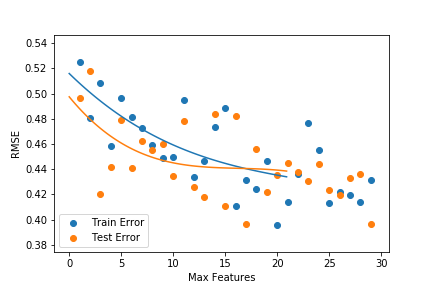

[Chong Geng](https://github.com/cgeng18), [Divya Bhargavi](https://github.com/Divya-usf), Robert Sandor, [Jian Wang](https://github.com/jwang1917), [Alan Perry](https://github.com/ajperry2)

# Home Depot Search Algorithm

## More saving. More doing.

### In 2015 Home Depot hosted a Kaggle competition to model how relevent items are to a given search term. 

### Our task is to take search queries, averaging three words in length, and predict which items are the most relevant using a relevancy score from 1.0 to 3.0 (with 3.0 indicating a higher relevancy to the search terms). We measured our model success in the same fashion as the competition with RMSE (Root Mean Squared Error).

**The data we were provided had the following columns:**

**SearchTerm:** Examples of queries which customers made of the search engine on homedepot.com

**Product Uid:** A unique numeric value assigned to each item

**Product Title:** The title of an item that is displayed on the website

**Name:** Name of an Item's attribute

**Value:** The value of an Item's attribute

**Product Description:** A sentence or two which describes an item in the inventory

**Relevance:** A score assigned that describes how relevant an item is to a given search term. This number was assigned by a domain expert.

Since we are predicting a continuous variable with known labels, this is a regression problem. However, our data has no numeric columns (save for the labels themselves); to produce these numeric predictions, we had to construct useful numeric features from these textual characteristics that were given to us.

**Some of the Numeric features in our model**

**Clean Length:** The number of words in the search term after punctuation and numbers are stripped and stop words are removed

**Title Length:** The number of words in an item's title

**Desc Length:** The number of words in an item's description 

**Cleaned Terms in Title:** The number of words in an item's title after punctuation and numbers are stripped and stop words are removed

**Cleaned Terms in Desc:** The number or words in an item's description after punctuation and numbers are stripped and stop words are removed

**Stemmed Terms in Title:** The number of unique words in an item's title after the words have been cleaned then truncated to the word's root

**Stemmed Terms in Desc:** The number of unique words in an item's description after the words have been cleaned then truncated to the word's root

**Neighbors in Title:** The number of words in an item's title which is similar in meaning (determined by Glove embedding) to a word in the search query

**Neighbors in Desc:** The number of words in an item's description which is similar in meaning (determined by Glove embedding) to a word in the search query

**Search Title Entropy** The entropy of the distribution of letters in the search term and an item's title

**Search Desc Entropy** The entropy of the distribution of letters in the search term and an item's description

**Jaccard Title Index** The cardinality of the intersection divided by the cardinality of the union, where the two sets are the sets of words in the title of in item and the search term

**Jaccard Desc Index** The cardinality of the intersection divided by the cardinality of the union, where the two sets are the sets of words in the description of in item and the search term

**LCS (Longest Common Subsequence) Title** The count of the longest common sequence of characters that are in the same relative order but are not necessarily contiguous (ex. LCS of 'nice' and 'niece' is 4) between the title and the search term

**LCS (Longest Common Subsequence) Desc** The count of the longest common sequence of characters that are in the same relative order but are not necessarily contiguous (ex. LCS of 'nice' and 'niece' is 4) between the product description and the search term

**NCD (Normalized Compression Distance) Query Title** A measure of similarity in which the search terms and the product title are compressed and compared bit by bit then normalized

**Search Title SW (Smith-Waterman)** A similarity metric (usually used to measure similarity between protein sequences) that compares segments of all possible lengths and optimizes the similarity measure between the search terms and the title

We also looked at including numeric characteristics of the lemmatized terms in the title and description. However, all of these variables had very large Variance Inflation Factors (VIFs), leading us to exclude them from our model. 

The highest VIF of a variable we kept in our model was 6.15.

## Modeling Methodology

We tested various linear and tree-based regression models with multiple sets of hyperparameters and compared their performances.

### Linear Regression

We tested regular linear regression, lasso regression, ridge regression, and elastic net linear regression. Our testing included observing the testing error. 

Our error was measured using two different two different metrics. One was the RMSE of our predictions of the relevance and the actual relevance. The second metric was the RMSE of the ten most relevant results our model predicted. The justification of this metric is that when someone uses a search engine, they only look at the top ten results.

#### Regular Linear Regression

-----
Demonstration

------

| Product Id   |      Predicted Relevance      |  Actual Relevance |
|----------|:-------------:|------:|
| 45055 | 2.63908569 | 3.00 |
|64720|2.2400152|1.00||
|71594|2.47129219|3.00|
|61619|2.31350679|2.33|
52166|2.50350051|2.67
       
We initially started off with a basic linear regression model as a sort of baseline model performance. Using such a model and an initial set of 5 features, we achieved approximately the benchmark score (.51049) for this competition.

#### Regularized Linear Regression

For Lasso, Ridge and ElasticNet, the RMSEs are 0.5308, 0.494, and 0.518, respectively. 

### Tree Models

With a vanilla random forest model we got an RMSE score of 0.469; with a gradient boosted regressor we got an RMSE of 0.483. 

When we used PCA to reduce the dimensionality of our data, we lowered this RMSE to 0.469.

Here are some pictures of the trees models top ten performance with different hyperparameters.

### GBR

### Regular Random Forest

So if you were to search with our algorithm the top ten results would be on average a 2.7 out of 3 in relevence.

## Top Performance

Our best RMSE score of .46453 (on the testing data) resulted from a Random Forest model with 135 trees where 4-5 features were considered at every split. Rerunning the model with different subsamples produced similar results. If we were to submit this result and get a similar RMSE score, it would be enough to place us within the top 10% of Kaggle competitors and earn a bronze model.

## Insights

### Feature Engineering REALLY Helps
The most important features turned out to be the more 'sophisticated features' like entropy and the normalized compression distance that we didn't immediately consider. Additionally, those features that take a long time to compute may actually be  worth the wait; in our model, the normalized compression distance, which took over 14 hours to compute, ended up being one of the more important features.

### Regularization/PCA Doesn't Always Help
Using models that incorporated regularization, like Lasso and ElasticNet, didn't significantly change the RMSE in this particular case despite evidence of multicollinearity.

### Ensembling Performs
While linear regression was a good model to start with for a regression problem such as this, ensembling algorithms like Random Forest made the most significant gains in performance and got us a competitive score. However, not all ensembling algorithms live up to their hype; AdaBoost and Gradient Boosting algorithms didn't perform better than Random Forest like we may have expected.
