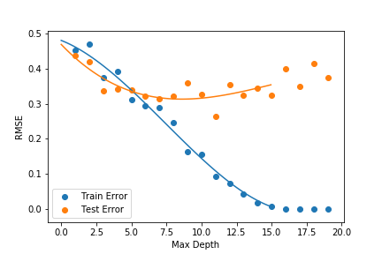

Chong, Divya, Robert, Jian, Alan

# Home Depot Search Algorithm

## More saving. More doing.

### In 2005 Home Depot hosted a Kaggle competition to model how relevent items are to a given search term. 

**The data had the following collumns:**

**SearchTerm:** Examples of queries which customers made of the search engine on homedepot.com

**Product Uid:** A unique numeric value assigned to each item

**Product Title:** The title of an item that is displayed on the website

**Name:** Name of an Item's attribute

**Value:** The value of an Item's attribute

**Product Description:** A sentence or two which describes an item in the inventory

**Relevance:** A score assigned that describes how relevant an item is to a given search term. This number was assigned by a domain expert.

As we are predicting a continuous variable with known labels this is a regression problem. This makes our problem to construct useful numeric features from these textual characteristics that were given to us.

**The Numeric features in our model**

**Clean Length:** The number of words in the search term after it is cleaned of impurities

**Title Length:** The number of words in an items title

**Desc Length:** The number or words in an items description 

**Cleaned Terms in Title:** The number of words in an items title after it has been cleaned of impurities

**Cleaned Terms in Desc:** The number or words in an items description after it has been cleaned of impurities

**Stemmed Terms in Title:** The number of unique words in an items title after the words have been cleaned then truncated to the words root

**Stemmed Terms in Desc:** The number of unique words in an items description after the words have been cleaned then truncated to the words root

**Neighbors in Title:** The number of words in an items title which is similar in meaning(determined by Glove embedding) to a word in the search query

**Neighbors in Desc:** The number of words in an items description which is similar in meaning(determined by Glove embedding) to a word in the search query

**Search Title Entropy** The kl-divergens of the distribution of letters in the search term and an items title

**Search Desc Entropy** The kl-divergens of the distribution of letters in the search term and an items description

**Jaccard Title Index** The cardinality of the intersection devided by the cardinality of the union, where the two sets are the sets of words in the title of in item and the search term

**Jaccard Desc Index** The cardinality of the intersection devided by the cardinality of the union, where the two sets are the sets of words in the description of in item and the search term

We also looked at including numeric characteristics of the lematized terms in the title and description. However all of these variables had very large Variance Inflation Factors(VIFs), making us exclude them from our model. 

The highest VIF of a variable we kept in our model was 6.15.

## Modeling Methodology

We tried linear and tree regression. We did extensive testing on each.

### Linear Regression

We tested regular linear regression, lasso linear regression, ridge linear regression, and elastic net linear regression. Our testing included observing the testing error. 

Our error was measured using two different two different metrics. One was the RMSE of our predictions of the relevance and the actual relevance. The second metric was the RMSE of the ten most relevant results our model predicted. The justification of this metric is that when someone uses a search engine, they only look at the top ten results.

#### Regular Linear Regression

-----
Demonstration

------

| Product Id   |      Predicted Relevance      |  Actual Relevance |
|----------|:-------------:|------:|
| 45055 | 2.63908569 | 3.00 |
|64720|2.2400152|1.00||
|71594|2.47129219|3.00|
|61619|2.31350679|2.33|
52166|2.50350051|2.67
       
While not great, these poor predictions are an excellent start.

#### Regularized Linear Regression

For lasso, ridge and elasticnet, the RMSEs in the respective order are 0.5308, 0.494, and 0.518. 

### Tree Models

With a regular decision tree model we got an RMSE score of 0.469 and with a gradient boosted regressor we got an RMSE of 0.483. 

If we used PCA to reduce our demensions, we can lower this RMSE to 0.469.

Here are some pictures of the trees models top ten performance with different hyperparameters.

### GBR

### Regular Random Forrest

So if you were to search with our algorithm the top ten results would be on average a 2.7 in relavence out of 3.

       
